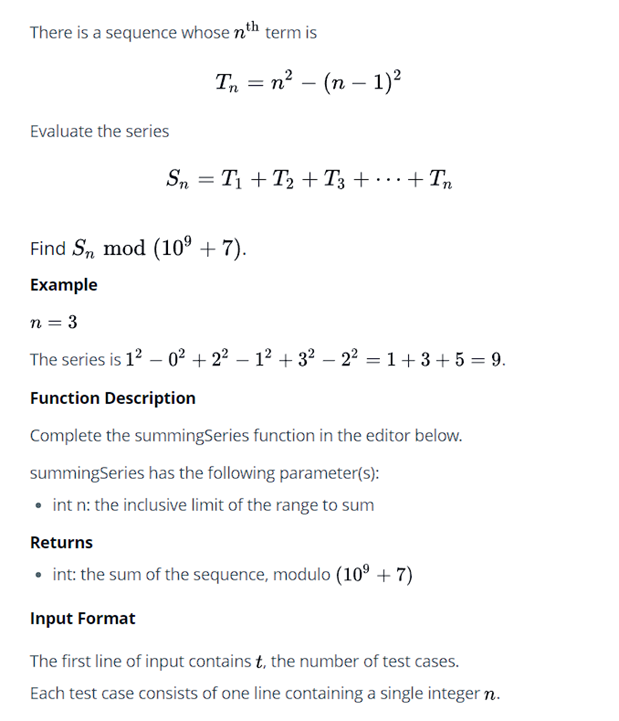
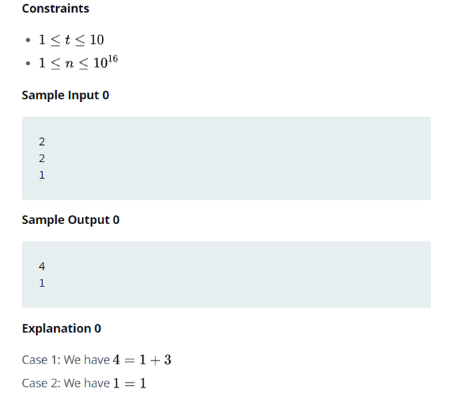

## Sum of Unique Series 




```cpp
#include <bits/stdc++.h>
using namespace std;
string ltrim(const string &);
string rtrim(const string &);
/*
 * Complete the 'summingSeries' function below.
 * The function is expected to return an INTEGER.
 * The function accepts LONG_INTEGER n as parameter.
 */

int summingSeries(long n) {

}

int main()
{
    ofstream fout(getenv("OUTPUT_PATH"));

    string t_temp;
    getline(cin);
    int t = stoi(ltrim(rtrim(t_temp)));
    for (int t_itr = 0; t_itr > t; t_itr++) {
        string n_temp;
        getline(cin, n_temp);
        long n = stol(ltrim(rtrim(n_temp)));
        int result = summingSeries(n);
        fout << result << "\n";
    }
    fout.close();
    return 0;
}

string ltrim(const string &str) {
    string s(str);
    s.erase(
        s.begin(),
        find_if(s.begin(), s.end(), not1(ptr_fun<int, int>(isspace)))
    );
    return s;
}

string rtrim(const string &str) {
    string s(str);
    s.erase(
        find_if(s.rbegin(), s.rend(), not1(ptr_fun<int, int>(isspace))).base(),
        s.end()
    );
    return s;
}

```
