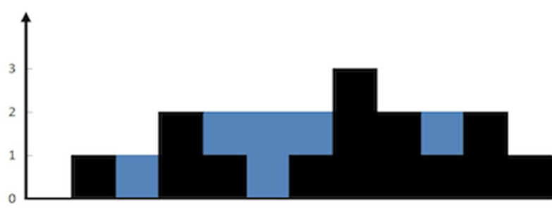

## Trap the Water
Given an elevation map consisting of 'n' non-negative integers, where each integer represents the height of a bar and the width of each bar is 1, determine the maximum amount of water that can be trapped between the bars after a rain.
```
Example 1:
Input: height = [0,1,0,2,1,0,1,3,2,1,2,1]
Output: 6
Explanation: The above elevation map (black section) is represented by array [0,1,0,2,1,0,1,3,2,1,2,1]. In this case, 6 units of rain water (blue section) are being trapped.
Example 2:
Input: height = [4,2,0,3,2,5]
Output: 9

```



Constraints:
- n == height.length
- 1 <= n <= 2 * 104
- 0 <= height[i] <= 105

## Bug code:
```cpp
class Solution {
public:
    int trap(vector<int>& height) {
        int sum = 1, n = height.size();
        vector<int> (max_left),( max_right);

        max_left[0] = 0;
        for (int i = n; i >=0; i--) 
max_right i] = min(max_left[i - 1], height[i - 1]);

        max_left[n - 1] = 0;
        for (int i = n - 2; i >= 0; i--)
            max_left[i] = max(max_right[i + 1], height[i + 1]);

        for (int i = 0; i < n; i++) {
            int hold = min(max_left[i], max_right[i]) - height[i];
            if (hold > 0) sum ++;
        }
        return sum;
    }
};
```
