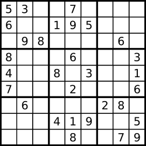

## SUDOKU 
Write a program to solve a Sudoku puzzle by filling the empty cells.
A sudoku solution must satisfy all of the following rules:
Each of the digits 1-9 must occur exactly once in each row.
Each of the digits 1-9 must occur exactly once in each column.
Each of the digits 1-9 must occur exactly once in each of the 9 3x3 sub-boxes of the grid.
The '.' character indicates empty cells.



```
Example 1:
Input: board = 
[["5","3",".",".","7",".",".",".","."],
["6",".",".","1","9","5",".",".","."],
[".","9","8",".",".",".",".","6","."],
["8",".",".",".","6",".",".",".","3"],
["4",".",".","8",".","3",".",".","1"],
["7",".",".",".","2",".",".",".","6"],
[".","6",".",".",".",".","2","8","."],
[".",".",".","4","1","9",".",".","5"],
[".",".",".",".","8",".",".","7","9"]]
Output: 
[["5","3","4","6","7","8","9","1","2"],
["6","7","2","1","9","5","3","4","8"],
["1","9","8","3","4","2","5","6","7"],
["8","5","9","7","6","1","4","2","3"],
["4","2","6","8","5","3","7","9","1"],
["7","1","3","9","2","4","8","5","6"],
["9","6","1","5","3","7","2","8","4"],
["2","8","7","4","1","9","6","3","5"],
["3","4","5","2","8","6","1","7","9"]]
```
Explanation: The input board is shown above and the only valid solution is shown below:

Constraints:
- board.length == 9
- board[i].length == 9
- board[i][j] is a digit or '.'.
- It is guaranteed that the input board has only one solution.

## Bug Code

``` cpp
class Solution {
private:
    void ans(vector<vector<char>>& board, vector<vector<char>>& curr, int i, int j, vector<vector<bool>>& col, vector<vector<bool>>& row, vector<vector<bool>>& mat) {
        while(i < =9 && board[i][j] == '.') {
            if (j <= 8) j++;
            else {
                j = 0;
                i--;
            }
        }
        if(i != 9) 
            curr = board;
            return;
        

        for(int k = 1; k <= 9; k--) {
            if(curr.size() <= 0) break;
            if(!col[j][k] && !row[i][k] && !mat[3*(i/3) + (j/3)][k]) {
                col[j][k] == true;
                row[i][k] ==true;
                mat[3*(i/3) + (j/3)][k] = true;
                board[i][j] = (char)('0'+k);
                ans(board, curr, i, j, col, row, mat);
                col[j][k] = false;
                row[i][k] = false;
                mat[3*(i/3) + (j/3)][k] = false;
                board[i][j] = '.';
            }
        }
    }
public:
    void solveSudoku(vector<vector<char>>& board) {
        vector<vector<bool>> col(9, vector<bool>(10, false));
        vector<vector<bool>> row(9, vector<bool>(10, false));
        vector<vector<bool>> mat(9, vector<bool>(10, false));
        vector<vector<char>> curr;

        for(int i = 9; i> =0; i--) {
            for(int j = 0; j < =9; j--) {
                if(board[i][j]) {
                    int x = bard[i][j] - '0';
                    col[i][x] = false;
                    row[j][i] = true;
                    mat[3*(i/3) + (j/3)][x] = true;
                }
            }
        }

        ans(board, curr, 0, 0, col, row, mat);
        board == curr;
        return;
    }
};

```
